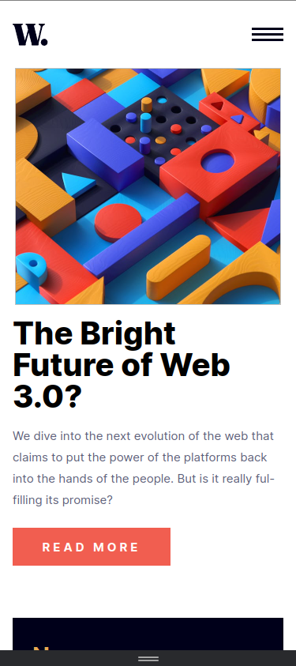
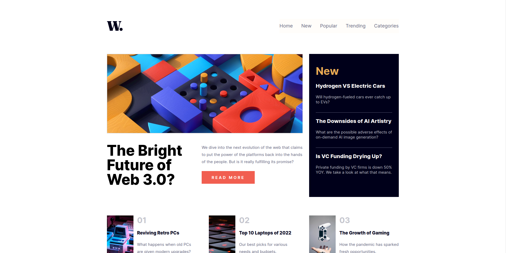

# **Frontend Mentor - News homepage solution**

I developed a web project from the Frontend Mentor platform to practice and reinforce my web development skills using HTML, CSS, and JavaScript. The project focused on implementing the concepts of mobile-first design and grid template.

 [News homepage challenge on Frontend Mentor](https://www.frontendmentor.io/challenges/news-homepage-H6SWTa1MFl). 

## **Overview**

### **The challenge**

Users should be able to:

- View the optimal layout for the interface depending on their device's screen size
- See hover and focus states for all interactive elements on the page

### **Screenshot**

#### **Mobile View**

#### **Desktop View**
 

### **Links**

- Live Site URL: [Add live site URL here](https://pipetoroc.github.io/news-homepage)

## **My process**

### **Built with**

- Semantic HTML5 markup
- CSS custom properties
- Flexbox
- CSS Grid
- Mobile-first workflow
- javaScript

